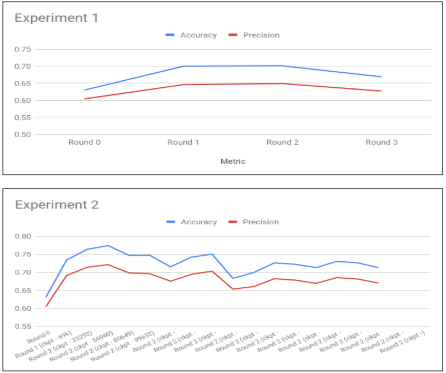

# Deep Learning for species detection in camera-trap data
This module helps in creating a weakly supervised feedback loop, run successive model trainings using the repo [training-species-detection](https://github.com/Manish-rai21bit/training-species-detection)and  evaluate the model performance.

For training an object detection model, we need a tons of training data with boxes drawn around each of the object of interest in the image along with their labels. Considering that we will need millions of images to train a deep neural network, it becomes a very tough task to prepare dataset to train an object detection model. In this work I use historical data classified by millions of volunteers with annotations at image level for species name and count of animals in the image. For counts >10, the volunteers were able to annotate the image into binned counts of 11-50 and 50+.

This historical volunteer classification data is used to validate the correctness of predictions made by the fine-tuned model, or correct the predictions in case where it is possible. The correct and corrected predictions are then converted to TF Records, added to the training dataset and used for subsequent training rounds.

**Experiments**:

2 Sets of experiments were conducted to prove the hypothesis that we can use transfer learning and weakly supervised learning technique to improve the prediction performance of object detection models. Experiments were conducted with different detection scores that were used to find training data for subsequent rounds.
- Experiment 1 - detection score threshold of 0, where we forced the model to pick the number of boxes in predictions to match the Volunteer count classifications.
- Experiment 2 - we forced the model to pick the number of boxes in predictions to match the Volunteer count classifications, for all detection score threshold at least 0.5.



Camera-traps are a rich data source for ecologists and is used to get a sense of the species population in the wild.

Steps for prediction are:
1. Create the tensorflow record for training and testing data. Here is the code used to generate the [tf_record](https://github.com/Manish-rai21bit/camera-trap-detection/blob/master/Data_Model.ipynb).
Once the data is created for training and testing we can use this data to train our model and test the performance.
2. A pre-trained Faster R-CNN is used as the base and retrained for our specific task of animal detection. The pre-trained model can be downloaded from [Tensorflow detection model zoo](https://github.com/tensorflow/models/blob/master/research/object_detection/g3doc/detection_model_zoo.md).
3. The directory structure for the training and prediction can be made similar to the [training_demo](https://github.com/Manish-rai21bit/camera-trap-detection/tree/master/training_demo). This directory can be placed inside the tensorflow/model directory from where we can trigger the below model training pipeline and graph export pipeline.

Model training pipeline to run as a sparete module

cd /Users/manishrai/Desktop/UMN/Research/Zooniverse/Code/tensorflow/models/my_workspace/training_demo
```
PIPELINE_CONFIG_PATH='training/faster_rcnn_resnet101_coco.config'
MODEL_DIR='/Users/manishrai/Desktop/UMN/Research/Zooniverse/Code/tensorflow/models/my_workspace/training_demo/training/'
NUM_TRAIN_STEPS=900000
NUM_EVAL_STEPS=2000
python model_main.py \
    --pipeline_config_path=${PIPELINE_CONFIG_PATH} \
    --model_dir=${MODEL_DIR} \
    --num_train_steps=${NUM_TRAIN_STEPS} \
    --num_eval_steps=${NUM_EVAL_STEPS} \
    --alsologtostderr
```

```
python export_inference_graph.py \
    --input_type image_tensor \
    --pipeline_config_path training/faster_rcnn_resnet101_coco.config \
    --trained_checkpoint_prefix training/model.ckpt-500 \
    --output_directory trained-inference-graphs/output_inference_graph_v1.pb
```


### Pipeline for boorstrapping data preparation for feeding back to training loop
**Predicted TFRecord to CSV decoder:**
```
python predictorExtractor_main.py \
    --tfrecord_path_list '/home/ubuntu/data/tensorflow/my_workspace/training_demo/Predictions/snapshot_serengeti_s01_s06-0-10000.record' \
    --output_csv '/home/ubuntu/data/tensorflow/my_workspace/training_demo/Predictions/snapshot_serengeti_s01_s06-0-10000.csv'
```
**Consolidated view with ground truth and predicted species count per image:**
```
python prediction_groundtruth_consolidation_main.py \
    --prediction_csv_path '/home/ubuntu/data/tensorflow/my_workspace/training_demo/Predictions/snapshot_serengeti_s01_s06-0-10000.csv' \
    --groundtruth_csv_path '/home/ubuntu/data/tensorflow/my_workspace/camera-trap-detection/data/LILA/db_export_season_all_cleaned.csv' \
    --label_map_json '/home/ubuntu/data/tensorflow/my_workspace/camera-trap-detection/data/LILA/label_map.json' \
    --outfile '/home/ubuntu/data/tensorflow/my_workspace/camera-trap-detection/pred_groundtruth_consolidate_csv.csv'
```
**Create CSV with bounding boxes for TFRecord encoding**
```
python bootstrapping_data_prep_main.py \
    --pred_groundtruth_consolidate_csv '/home/ubuntu/data/tensorflow/my_workspace/camera-trap-detection/pred_groundtruth_consolidate_csv.csv' \
    --prediction_csv_path '/home/ubuntu/data/tensorflow/my_workspace/training_demo/Predictions/snapshot_serengeti_s01_s06-0-10000.csv' \
    --label_map_json '/home/ubuntu/data/tensorflow/my_workspace/camera-trap-detection/data/LILA/label_map.json' \
    --outfile '/home/ubuntu/data/tensorflow/my_workspace/training_demo/Predictions/bootstrap_data_snapshot_serengeti_s01_s06-0-10000.csv'
```
**move the output of the abobe file to MSI and run this on MSI**
**TFRecord encoder for bootstrapped bounding box**
```
python tfr_encoder_for_bootstarpping_main.py \
    --image_filepath '/panfs/roc/groups/5/packerc/shared/albums/SER/' \
    --bounding_box_csv 'bootstrap_data_snapshot_serengeti_s01_s06-0-10000.csv' \
    --label_map_json '/home/packerc/rai00007/camera-trap-detection/data/LILA/label_map.json' \
    --output_tfrecord_file 'out_tfr_file.record'
```
